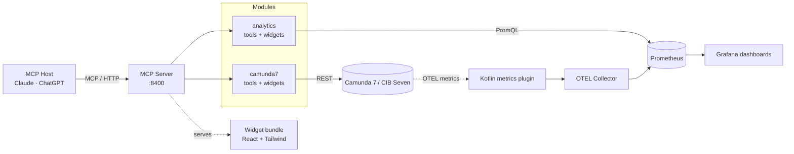

# Architecture

The platform is a single Node.js MCP server that exposes Camunda 7 / CIB Seven
operations and Prometheus-backed analytics to any MCP host (Claude, ChatGPT, …).
A Kotlin plugin in the engine emits process metrics via OpenTelemetry; the OTEL
Collector exports them to Prometheus so the analytics module can query them.

## At a glance

## Modules

| Module                                                | Role                                                                                                                                                   |
| ----------------------------------------------------- | ------------------------------------------------------------------------------------------------------------------------------------------------------ |
| **MCP Server** (`apps/mcp-server-camunda7/`)          | Hosts the HTTP transport on port `8400`, loads modules from `MCP_ACTIVE_MODULES`, and serves a single-file React widget bundle.                        |
| **camunda7** (`packages/mcp-camunda7/`)               | Wraps the Camunda 7 / CIB Seven REST API via an OpenAPI-generated client. Exposes process, task, incident, deployment, and history tools plus widgets. |
| **analytics** (`packages/mcp-analytics/`)             | Queries Prometheus via PromQL for performance, failure, bottleneck, and version/cluster comparison. Tools + dashboard, failure, and compare widgets.   |
| **engine-plugins** (`engine-plugins/`)                | Kotlin OTEL plugins for CIB Seven: a process-metrics emitter. Independent build (Java 21, Gradle). No engine-side database.                            |
| **widgets** (`apps/mcp-server-camunda7/mcp-app.html`) | A single Vite-built HTML bundle containing React, Tailwind, and every widget. The MCP host renders it inline when a tool returns `{ widget, data }`.   |

## Composition rules

A small set of layering rules keeps modules independently usable and a future
second engine dialect cheap:

- **App = one product per engine dialect.** `apps/mcp-server-camunda7` is the
  thin composition root of the Camunda-7-dialect product (camunda7 +
  analytics). Engine _vendors_ of that dialect (CIB Seven, Operaton, Camunda 7)
  are per-engine runtime configuration (`flavor` on the engine entry, resolved
  to an `EngineProvider` carrying only the real differences: cockpit routes,
  branding, client hook) — never separate apps. A different
  dialect (e.g. Flowable, with its own REST API) would be its own module,
  client, and app.
- **Modules are peers.** `mcp-*` packages never import each other. Cross-module
  capabilities are injected by the app — e.g. the camunda7 module's BPMN-XML
  lookup feeding the analytics heatmap (`SharedResources.fetchBpmnXml`).
- **Modules are self-contained.** Each exports a module definition — config
  schema, env mapping, known env vars, boot warnings, plugin factory
  (`packages/*/src/module.ts`). The app only selects modules
  (`MCP_ACTIVE_MODULES`) and wires shared resources against its own port
  (`apps/mcp-server-camunda7/src/module-contract.ts`).
- **Apps own no domain UI.** Widgets and their catalogues live in packages:
  `widget-shell` carries the generic primitives plus the `shell:*` widgets;
  each module carries its own. Cross-module UI has three sanctioned tiers —
  generic `shell:*` widgets fed via `props.dataKey`, tool-name string
  references with graceful degradation, and hard-composed views in a dedicated
  package (created with the first real view).
- **Extract on the second consumer, never speculatively.** A composed-views
  package appears with the first cross-module view, a shared domain-widget
  package with a second dialect, a host-kit with a second app.

## External systems

| System                  | Purpose                                                                        | Default endpoint                    |
| ----------------------- | ------------------------------------------------------------------------------ | ----------------------------------- |
| Camunda 7 / CIB Seven   | The BPM engine itself — process definitions, instances, tasks, incidents.      | `http://localhost:8410/engine-rest` |
| OpenTelemetry collector | Receives OTLP from the engine; exports metrics to Prometheus.                  | `:8431` (OTLP HTTP)                 |
| Prometheus              | Time-series store for the process metrics; the analytics module's data source. | `http://localhost:8460`             |
| Grafana                 | Provisioned process-analytics dashboards over Prometheus.                      | `http://localhost:8470`             |

## Data flow

1. The MCP host calls a tool on the server (e.g. `analytics_element_bottleneck`).
2. The server delegates to the matching module's plugin.
3. The plugin calls the relevant system (REST for the engine, PromQL for
   Prometheus) and returns structured content.
4. Widget tools also return a `widget` key — the host renders the corresponding
   React component from the shared bundle and feeds it the `data`.

Process metrics originate in the engine: the Kotlin plugin maps history events
to OTEL counters/histograms (100 % coverage, model-bounded labels), the Collector
serves them, and Prometheus stores them. Per-instance drill-down (search) is
served by the engine REST history API, not the metrics.

## Repository layout

| Path                        | Description                                              |
| --------------------------- | -------------------------------------------------------- |
| `apps/mcp-server-camunda7/` | The MCP server entry point and the widget bundle.        |
| `packages/`                 | Reusable libraries — clients, MCP plugins, widget-shell. |
| `engine-plugins/`           | Kotlin OTEL plugins (process metrics).                   |
| `playground/`               | Demo env: showcases, Compose stack, Fly.io deployment.   |

For deeper detail, the root [`README.md`](https://github.com/miragon/miragon-ai/blob/main/README.md) keeps the full module table and tool list.
