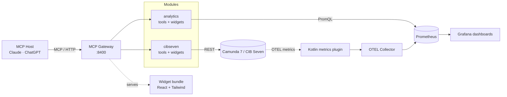

# Architecture

The platform is a single Node.js MCP server that exposes Camunda 7 / CIB Seven
operations and Prometheus-backed analytics to any MCP host (Claude, ChatGPT, …).
A Kotlin plugin in the engine emits process metrics via OpenTelemetry; the OTEL
Collector exports them to Prometheus so the analytics module can query them.

## At a glance

## Modules

| Module                                        | Role                                                                                                                                                   |
| --------------------------------------------- | ------------------------------------------------------------------------------------------------------------------------------------------------------ |
| **MCP Gateway** (`apps/mcp-gateway/`)         | Hosts the HTTP transport on port `8400`, loads modules from `MCP_ACTIVE_MODULES`, and serves a single-file React widget bundle.                        |
| **cibseven** (`packages/mcp-cibseven/`)       | Wraps the Camunda 7 / CIB Seven REST API via an OpenAPI-generated client. Exposes process, task, incident, deployment, and history tools plus widgets. |
| **analytics** (`packages/mcp-analytics/`)     | Queries Prometheus via PromQL for performance, failure, bottleneck, and version/cluster comparison. Tools + dashboard, failure, and compare widgets.   |
| **engine-plugins** (`engine-plugins/`)        | Kotlin OTEL plugins for CIB Seven: a process-metrics emitter. Independent build (Java 21, Gradle). No engine-side database.                            |
| **widgets** (`apps/mcp-gateway/mcp-app.html`) | A single Vite-built HTML bundle containing React, Tailwind, and every widget. The MCP host renders it inline when a tool returns `{ widget, data }`.   |

## External systems

| System                  | Purpose                                                                        | Default endpoint                    |
| ----------------------- | ------------------------------------------------------------------------------ | ----------------------------------- |
| Camunda 7 / CIB Seven   | The BPM engine itself — process definitions, instances, tasks, incidents.      | `http://localhost:8410/engine-rest` |
| OpenTelemetry collector | Receives OTLP from the engine; exports metrics to Prometheus.                  | `:8431` (OTLP HTTP)                 |
| Prometheus              | Time-series store for the process metrics; the analytics module's data source. | `http://localhost:8460`             |
| Grafana                 | Provisioned process-analytics dashboards over Prometheus.                      | `http://localhost:8470`             |

## Data flow

1. The MCP host calls a tool on the server (e.g. `analytics_element_bottleneck`).
2. The server delegates to the matching module's plugin.
3. The plugin calls the relevant system (REST for the engine, PromQL for
   Prometheus) and returns structured content.
4. Widget tools also return a `widget` key — the host renders the corresponding
   React component from the shared bundle and feeds it the `data`.

Process metrics originate in the engine: the Kotlin plugin maps history events
to OTEL counters/histograms (100 % coverage, model-bounded labels), the Collector
serves them, and Prometheus stores them. Per-instance drill-down (search) is
served by the engine REST history API, not the metrics.

## Repository layout

| Path                | Description                                                 |
| ------------------- | ----------------------------------------------------------- |
| `apps/mcp-gateway/` | The MCP gateway entry point and the widget bundle.          |
| `packages/`         | Reusable libraries — clients, MCP plugins, widget-shell.    |
| `engine-plugins/`   | Kotlin OTEL plugins (process metrics).                      |
| `examples/`         | Standalone showcases (miravelo-upstream, cibseven-example). |
| `docker/`           | Compose stack: engine, OTEL Collector, Prometheus, Grafana. |

For deeper detail, the root [`README.md`](https://github.com/miragon/miragon-ai/blob/main/README.md) keeps the full module table and tool list.
