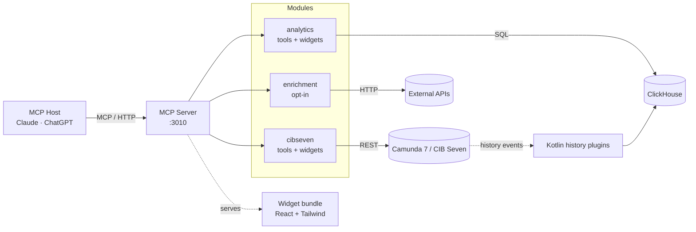

# Architecture

The platform is a single Node.js MCP server that exposes Camunda 7 / CIB Seven
operations and ClickHouse-backed analytics to any MCP host (Claude, ChatGPT, …).
A separate Kotlin pipeline streams the engine's history into ClickHouse so the
analytics module can query it.

## At a glance

## Modules

| Module                               | Role                                                                                                                                                     |
| ------------------------------------ | -------------------------------------------------------------------------------------------------------------------------------------------------------- |
| **MCP Server** (`server/`)           | Hosts the HTTP transport on port `3010`, loads modules from `MCP_ACTIVE_MODULES`, and serves a single-file React widget bundle.                          |
| **cibseven** (`modules/cibseven/`)   | Wraps the Camunda 7 / CIB Seven REST API via an OpenAPI-generated client. Exposes 37 tools (process, task, incident, deployment, history) and 5 widgets. |
| **analytics** (`modules/analytics/`) | Queries the ClickHouse `camunda_history` database for performance, failure, and path-frequency analyses. 6 tools + 1 dashboard widget.                   |
| **enrichment** (opt-in)              | YAML-driven REST lookups that attach business context to process variables. Activated only when `ENRICHMENT_CONFIG_PATH` is set.                         |
| **history plugins** (`plugins/`)     | Kotlin plugins for CIB Seven that mirror history events into ClickHouse. Independent build (Java 21, Gradle).                                            |
| **widgets** (`server/mcp-app.html`)  | A single Vite-built HTML bundle containing React, Tailwind, and every widget. The MCP host renders it inline when a tool returns `{ widget, data }`.     |

## External systems

| System                           | Purpose                                                                   | Default endpoint                      |
| -------------------------------- | ------------------------------------------------------------------------- | ------------------------------------- |
| Camunda 7 / CIB Seven            | The BPM engine itself — process definitions, instances, tasks, incidents. | `http://localhost:8080/engine-rest`   |
| ClickHouse                       | OLAP store for engine history, fed by the Kotlin plugins.                 | `http://localhost:8123`               |
| OpenTelemetry collector + Jaeger | Optional tracing pipeline.                                                | `:4318` (OTLP) · `:16686` (Jaeger UI) |
| WireMock                         | Local stubs for the enrichment examples.                                  | `:8088`                               |

## Data flow

1. The MCP host calls a tool on the server (e.g. `camunda7_list_incidents`).
2. The server delegates to the matching module's plugin.
3. The plugin calls the relevant external system (REST for the engine, SQL for ClickHouse) and returns structured content.
4. Widget tools also return a `widget` key — the host renders the corresponding React component from the shared bundle and feeds it the `data`.

## Repository layout

| Path                           | Description                                             |
| ------------------------------ | ------------------------------------------------------- |
| `server/`                      | The MCP server entry point and the widget bundle.       |
| `modules/cibseven/`            | OpenAPI client + MCP plugin for the engine.             |
| `modules/analytics/`           | ClickHouse client + MCP plugin for analytics.           |
| `packages/core`, `packages/ui` | Shared plugin interface and shadcn/Tailwind primitives. |
| `plugins/`                     | Kotlin history plugins.                                 |
| `docker/`                      | Compose stack for engine, ClickHouse, OTEL, WireMock.   |

For deeper detail, the root [`README.md`](https://github.com/miragon/miragon-ai/blob/main/README.md) keeps the full module table and tool list.
